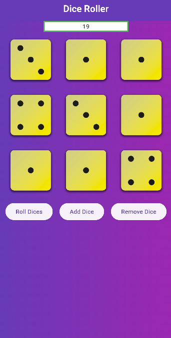
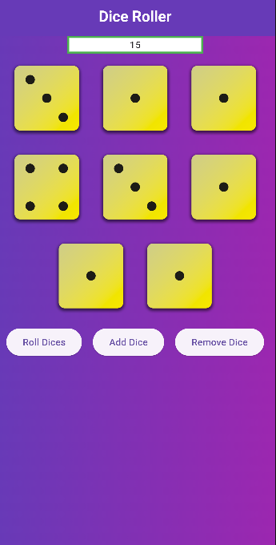

# 🎲 Flutter Dice Roller App

A simple yet fun **Flutter Dice Roller App** that allows users to:  
✅ Add up to **9 dice** 🎲 
✅ **Roll the dice** and get random values  
✅ View the **sum** of all dice at the top of the screen  
✅ Remove dice, and the sum decreases accordingly

---

## 📸 Screenshots

    

---

## ✨ Features

- 🎲 **Add & Remove Dice** (Up to 9)
- 🔄 **Roll Dice** to generate random values
- 🔢 **Real-time Summation** displayed at the top
- 🏗️ **Smooth Animations & UI**
- 🎨 **User-friendly Interface**

---

